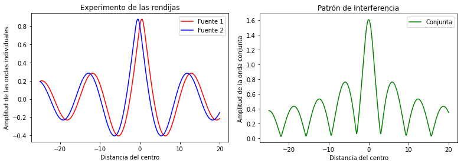
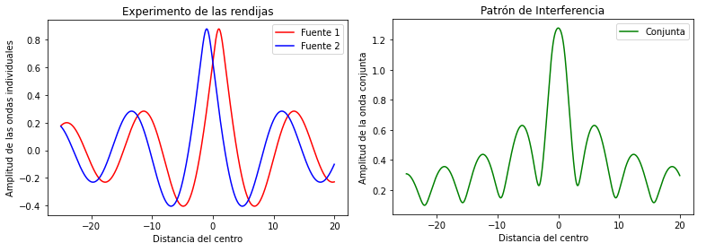
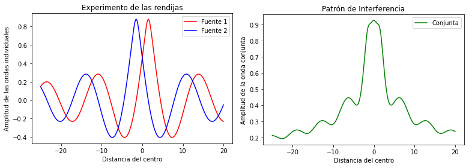
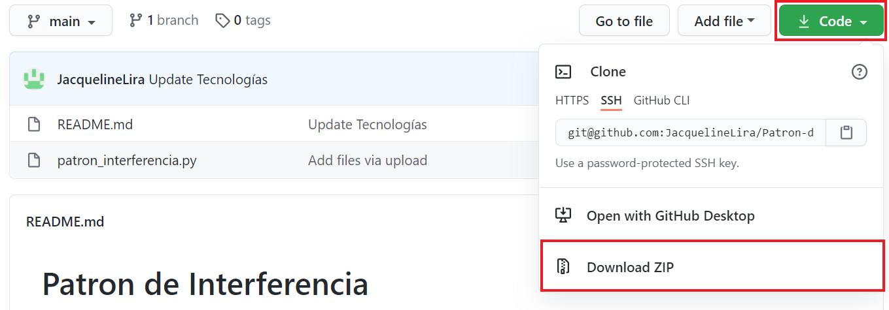

# Patron de Interferencia
> Para este proyecto consideramos el experimento de las rendijas con una fuente de onda. Se calculó el patrón de interferencia que se obtenía cuando se cambiaban diversas variables. Entre estas, se encontraba la distancia a las rendijas y las intensidad de la onda.
## Tabla de Contenidos
* [Información General](#información-general)
* [Funcionamiento](#funcionamiento)
* [Ejemplos](#ejemplos)
* [Tecnologías](#tecnologías)
* [Código](#código)
* [Instalación](#instalación)
* [Contacto](#contacto)
## Información General


El experimento de la doble rendija, o experimento de Young, es un experimento en dónde se hace pasar una fuente de luz por una pared con dos rendijas. Cada una de estas rendijas produce una nueva onda, como se ve en la imágen anterior. Estas ondas *interfieren* entre ellas, creando un patrón de interferencia. Cuando las dos ondas están en fase, es decir, sus crestas chocan o sus valles chocan, crean **interferencia constructiva**. En cambio cuando la cresta de una choca con el valle de la otra, en desfase, genera **interferencia destructiva**. En dónde las ondas se reinforcan, se obtiene una luz brillante, mientras que en dónde se cancelan se genera un punto obscuro, generando lo que se conoce como **patrón de interferencia**.


## Funcionamiento
Dentro del programa, algunos parámetros que se le pueden cambiar son:
* **D**, la distancia entre la pared y la pantalla
* **d**, la distancia entre las dos rendijas
* **a**, la intensidad de la onda fuente
## Ejemplos
A continuación se muestra el patrón de interferencia de la onda cuando se varía la distancia entre las rendijas.
* 0.5 metros



* 1 metro



* 1.5 metros



## Tecnologías
El proyecto se creó utilizando la versión **3.8.3** de Python, junto con las siguientes librerías:
* Numpy      - Versión **1.18.5**
* Matplotlib - Versión **3.2.2**
## Código
El código siguiente muestra cómo se calculo la intensidad de la onda conjunta en un punto **x**.

Primero se calculó la **intensidad** de cada una de las ondas en el punto.
``` Python
a_1 = a / pow(pow(D, 2) + pow(x - d, 2), 1 / 4)
a_2 = a / pow(pow(D, 2) + pow(x + d, 2), 1 / 4)
```
Después se calculó el valor de **phi**.
``` Python
phi_1 = k * pow(pow(D, 2) + pow(x - d, 2), 1 / 2)
phi_2 = k * pow(pow(D, 2) + pow(x + d, 2), 1 / 2)
```
Posteriormente se calculó la **elevación** de las ondas, esto es, la amplitud de cada una de las ondas individuales.
``` Python
elv_1 = a_1 * np.cos(phi_1)
elv_2 = a_2 * np.cos(phi_2)
```
Por último, se obtuvo el **patrón de interferencia**, es decir, la intensidad de la onda en la pared.
``` Python
amp = pow(pow(elv_1, 2) + pow(elv_2, 2) + 2 * elv_1 * elv_2 * np.cos(phi_1 - phi_2), 1 / 2)
```
## Instalación
### Descarga ZIP
Para descargar el repositorio, de click en el botón **Code** y seleccione la opción **Download ZIP**. 
Una vez descargado el archivo .zip, extraiga todos los archivos adentro y corra el programa *patron_interferencia.py*
### Clonar Repositorio
Para clonar el repositorio, siga las [instrucciones](https://docs.github.com/en/github/creating-cloning-and-archiving-repositories/cloning-a-repository#:~:text=%20Cloning%20an%20empty%20repository%20%201%20On,and%20then%20paste%20the%20URL%20you...%20More) de Github.
## Contacto
